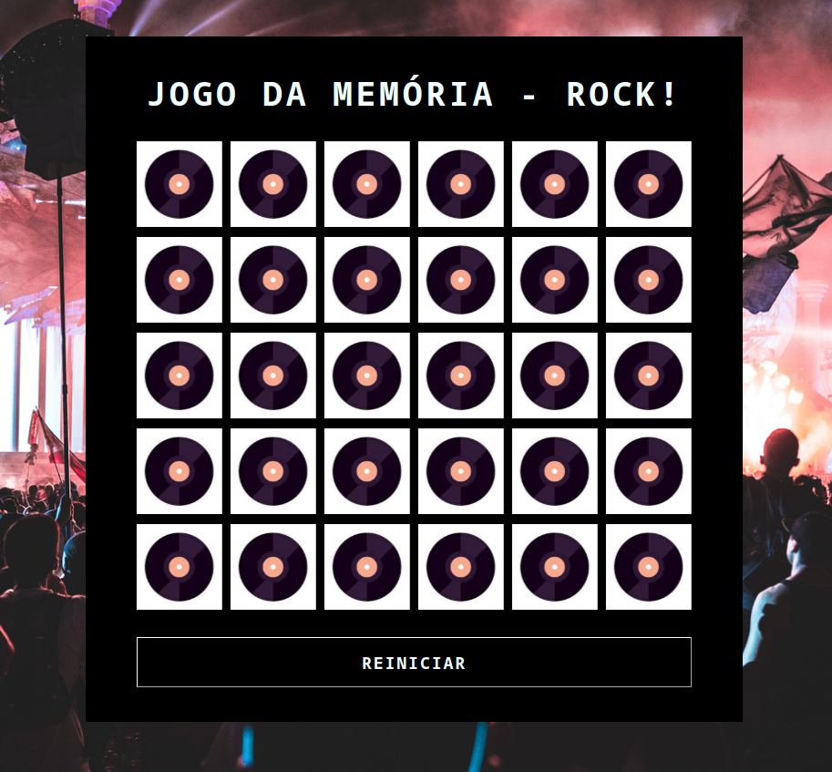

# Jogo da Memória - Álbuns de Rock 🎸

Um simples jogo da memória desenvolvido com HTML, CSS e JavaScript, com a temática de capas de álbuns de rock. O objetivo é encontrar todos os pares correspondentes de capas de álbuns.

## Instruções de Uso

1. Abra o arquivo `index.html` em um navegador web.
2. Clique nos discos para revelar as capas dos álbuns.
3. Tente encontrar todos os pares correspondentes.
4. O jogo é vencido quando todos os pares foram encontrados.

## Estrutura do Projeto

- **index.html**: Página principal do jogo.
- **style.css**: Estilos para a apresentação visual.
- **script.js**: Lógica do jogo implementada em JavaScript.
- **src/imagens**: Pasta contendo as capas dos álbuns.

## Pré-requisitos

- Um navegador web moderno.

## Personalização

- Adicione mais capas de álbuns ao array `discos` em `script.js`.
- Modifique o tema e estilos no arquivo `style.css` conforme desejado.

## Como Contribuir

Se você quiser contribuir para melhorar este jogo, sinta-se à vontade para:

- Reportar problemas ou bugs.
- Propor novos recursos.
- Enviar solicitações de pull requests.

## Agradecimentos

- Capas de álbuns de diversas bandas de rock que tornaram este jogo mais divertido!

Divirta-se jogando e desafiando sua memória com as lendárias capas de álbuns de rock! 🤘
